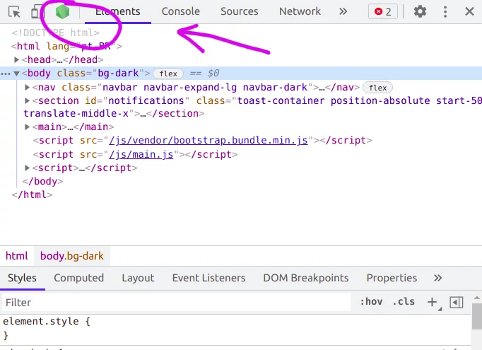

# Jardim Zumbi

Um dia normal no Jardim Zumbi (fictício).


## Atividade

Em 3 exercícios, você deve implementar as funcionalidades faltantes do Jardim Zumbi, que são:

1. A rota e a lógica de banco de dados para **excluir uma pessoa**
1. A rota e a lógica de banco para **adicionar uma pessoa**
1. Implementar a **negocição de conteúdo** para a listagem de pessoas
   - Observe como `routes/zombies.js` responde tanto em HTML quanto em JSON e faça algo parecido

Todos os exercícios devem ser feitos no arquivo `routes/people.js`, onde
estão definidas todas as rotas relativas ao recurso `person`.

Primeiramente, faça um _fork_ deste repositório no GitHub e clone-o
para seu computador.


## Pré-requisito: MySQL Server

Para esta prática, você vai precisar do MySQL, além do
_setup_ tradicional do Node.js presente nos melhores computadores.

Ele pode (1) ser instalado no próprio computador ou (2) ser usado por meio de uma imagem do Docker.


<details>
  <summary>
    (1) Instalando e usando MySQL Server diretamente no host
  </summary>

  - No Linux (_Debian based_) é facinho:
    ```
    $ sudo apt-get update
    $ sudo apt-get install -y mysql-server
    ```
    - Neste momento, uma tela sensacional será aberta perguntando qual a
      **senha** deve ser atribuída ao **usuário `root`**. Neste exercício `db.js` espera que seja `123456`
      - Claro, não faça isso em um servidor web de verdade ;)
  - No Windows, sugiro baixar o
    [instalador do MySQL Server](https://dev.mysql.com/downloads/installer/)
    no site oficial
  - No OS X, [eu não sei como fazer :3](https://dev.mysql.com/doc/refman/5.7/en/osx-installation-pkg.html)

  Quando instalado, o MySQL expõe uma CLI (_command line interface_) que é
  acessível pelo nome de `mysql`. Para verificar que ele está funcionando
  devidamente e validar este passo do trabalho, execute:
  ```
  $ mysql -u root -p
  ```
    - Esse comando nos traz para um ambiente onde podemos executar comandos
    contra os bancos de dados presentes na instância do MySQL que acabamos
    de instalar. Por exemplo:
    ```
    $ mysql> show databases;
    ```

</details>

<details>
  <summary>
    (2) Instalando Docker e usando imagem do MySQL
  </summary>

  - Instale o Docker [seguindo as instruções][install-docker] (caso já não esteja instalado)
  - Construa a imagem Docker representada pelo `Dockerfile` nesta pasta:
    ```bash
    sudo docker build -t zombies-db .
    # ou
    npm run build-db
    ```
    - Ao fazê-lo, o Docker vai baixar as imagens necessárias
</details>

Se você chegou até aqui, segure na mão de Deus e continue.

[install-docker]: https://docs.docker.com/engine/install/


## Banco de dados

A aplicacao requer um banco de dados MySQL e você deve usar os arquivos dentro de `db-migrations/` para criar uma instância do banco com alguns
dados pré-populados.


<details>
  <summary>
    (1) Restaurando banco com MySQL instalado no computador
  </summary>

  Para isso, em linha de comando:

  ```bash
  mysql -u root -p < db-migrations/001-create-db-zombies.sql
  mysql -u root -p < db-migrations/002-populate-zombies.sql
  ```
  - Ao fazê-lo, os _scripts_ em `db-migrations/` devem ter sido executados e o banco criado e populado

  E continue lendo as intruções...
</details>

<details>
  <summary>
    (2) Restaurando banco em container Docker
  </summary>

  - Após ter construído a imagem Docker, basta inicializar o _container_ baseado nela:
    ```bash
    sudo docker run -d -p 3306:3306 zombies-db
    # ou
    npm run start-db
    ```
    - Ao fazê-lo, os _scripts_ em `db-migrations/` devem ter sido executados e o banco criado e populado
    - Depois disso, você pode verificar se foi criado um _container_ executando:
      ```bash
      sudo docker ps
      ```
      - "Anote" o _container id_
    - Agora, entre no _container_ para verificar se o banco de fato está lá:
      ```bash
      sudo docker exec -it CONTAINER_ID bash
      ```
    - E continue lendo as intruções...
</details>


Para verificar que tudo está certo como deveria ser:

```bash
$ mysql -u root -p
mysql> show databases;
mysql> use zombies;
mysql> select * from person;
```
- E você deve ver uma lista com algumas pessoas da tabela `person`

Com tudo certo, siga adiante, bravo(a) programador(a).

Para sair: vá dando `exit` no console até voltar ao console
da pasta do projeto.


## Instruções de execução

Tente executar a aplicação usando o comando a seguir e repare que não
funcionará:

```
$ npm start
```
  - O motivo do erro é que as dependências do projeto ainda não estão
    instaladas

Em seguida, instale as dependências do projeto, que já foram definidas no
arquivo `package.json`:

```
$ npm install
```

Agora, tente executar novamente. Outra vez, um erro teimoso:

  - Desta vez, vamos usar um pacote chamado `nodemon` para executar
    a aplicação, em vez do próprio `node`
  - Motivo: o `node` fecha sozinho sempre que uma exceção não tratada é
    lançada. O `nodemon` (_node monitor_) executa o programa e dá _restart_
    no Node.js caso ele se encerre abruptamente

Instale de forma global o `nodemon`:

```bash
npm install -g nodemon
# ou
npm i -g nodemon
```

Para acionar o servidor, você poderia executar `nodemon bin/www.js`. Contudo,
repare que o arquivo `package.json` contém uma propriedade `scripts.start`,
cujo valor é exatamente `nodemon bin/www.js`:


Sendo assim, basta executar:

```
$ npm start
```
  - ...e o `npm` executará exatamente o que está no `package.json`


Isso acionará o `nodemon` e manterá o `node` em execução para sempre.
Além disso, o `nodemon` reinicia o servidor sempre que detecta alterações
no código fonte, fazendo com que não seja necessário parar o servidor e
abri-lo novamente.

<details>
  <summary>
    Se der erro de acesso ao banco de dados...
  </summary>

  Executando novamente a aplicação, nos deparamos com isto:
  
    - Motivo: a aplicação `cefet-web-zombie-garden` acessa o banco de dados
      a partir de um certo usuário e senha e esse erro indica que o
      usuário/senha usados pela aplicação não estão corretos

  Para corrigir este problema, abra o arquivo `db.js` na raiz do projeto
  e configure devidamente os dados de conexão com o banco de dados -
  possivelmente você deve precisar apenas de colocar a senha do
  usuário `root` do MySQL.
</details>


Ao executar a aplicação:

```
$ npm start
```

Não havendo erros, ela abre na porta 3000. Portanto, visite: http://localhost:3000/ e
faça sua primeira visita ao Jardim Zumbi.


## FAQ

- **Pergunta**: Professor, por quê não disponibilizar o código com tudo
  configuradinho de primeira? Você gosta de ver os alunos perdendo tempo?
  - **Resposta**: objetivos pedagógicos :scream:
- **Pergunta**: Esse MySQL ridículo só tem linha de comando?? Cadê as
  interfaces gráficas tão prometidas??
  - **Resposta**: [MySQL Workbench](https://www.mysql.com/products/workbench/)
    :smirk:
- **Pergunta**: Professor, a linguagem `['Java', 'C#', 'C'].pick()` me deixa
  depurar meu programa para que eu veja direitinho o que está acontecendo,
  passo a passo. Node.js é um lixo!
  - **Resposta**: [engana-se muito](#debugging), jovem Padawan
- **Pergunta**: Estou no arquivo `routes/people.js` e criei uma rota
  de `POST` para `/people`. Mas quando eu envio o formulário para cadastro de
  nova pessoa, estou recebendo mensagem de erro 404 (rota inexistente).
  Como faz?
  - **Resposta rapidinha**: crie a rota para a URL `/` em vez de `/people`
  - **Resposta bacana**: para aplicações mais grandinhas em Express.js, convém
    deixar o código da aplicação bem organizado e dividido em vários arquivos.
    Neste caso do código do Jardim Zumbi, as rotas estão divididas entre os
    arquivos da pasta `routes/` (`index.js`, `people.js` e `zombies.js`). Se
    você abrir o arquivo na raiz do projeto `/app.js`, verá:

    ```js
    import index from './routes/index.js'
    import people from './routes/people.js'
    import zombies from './routes/zombies.js'

    // ...
    app.use('/', index);          // rotas da página inicial
    app.use('/people', people);   // rotas das páginas que começam com "/people"
    app.use('/zombies', zombies); // rotas das páginas que começam com "/zombies"
    ```

    Dentro de cada arquivo da pasta `routes`, estamos instanciando um
    [`express.Router()`](http://expressjs.com/pt-br/guide/routing.html#express-router)
    do Express.js que nos permite definir rotas para um certo prefixo
    (e.g., `'/'`, `'/people'`, `'/zombies'` etc.).

    Assim, uma rota definida pelo roteador que está em `routes/people.js` para
    a URL `'/'`, está, na verdade, sendo uma rota para a URL `'/people/'`.
    Se for `'/new'`, é na verdade `'/people/new'` e assim por diante.
- **Pergunta**: Estou usando `req.params.XXX` para pegar o nome da pessoa que
  deve ser cadastrada no banco, mas está vindo sempre `undefined`. Por quê?
  - **Resposta**: o nome da pessoa está sendo enviado por um formulário
    via método `POST` (para tudo que está fazendo e abra o arquivo
    `views/new-person.hbs`).

    Para recuperar algo enviado via `POST` no Express.js, você deve usar
    [`req.body.XXX`](http://expressjs.com/pt-br/4x/api.html#req.body)
    (o `req.params.XXX` recupera parâmetros da rota, tipo
    `/people/:id-da-pessoa`).
- **Pergunta**: Mesmo lendo a resposta anterior, ainda não sei o que colocar no
  `req.body.XXX`. O que é esse `XXX`?
  - **Resposta**: cada campo (`input`) do formulário sendo enviado (no caso,
    o `form` em `views/new-person.hbs`) possui um atributo chamado `name` que
    contém o nome do campo que será recebido na rota. **Não confunda o
    atributo HTML `name` com o atributo `id`**: para formulários, o `id` não
    tem nenhuma utilidade, mas o `name` sim.


## _Debugging_

Se quiser fazer _debugging_, precisamos passar um argumento de linha de comando
para o Node e, depois, abrir o Chrome e usar as
_dev tools_ e depurar o programa como se estivesse em um navegador.


Na hora de iniciar a aplicação, em vez de usar `npm start`, use:

```
$ node --inspect-brk bin/www.js
```

Abra o Chrome em qualquer aba/site, abra as ferramentas do desenvolvedor e clique no ícone do Node.js que aparece no topo:



Isso faz uma nova janela abrir com novas _dev tools_, mas apenas as funcionalidades relacionadas ao Node.js (eg, nada de DOM).

Devido ao `--inspect-brk`, o Node coloca um _break-point_ na primeira linha do programa (`bin/www.js`). De lá, você pode colocar outros pontos de parada e depurar normalmente.

